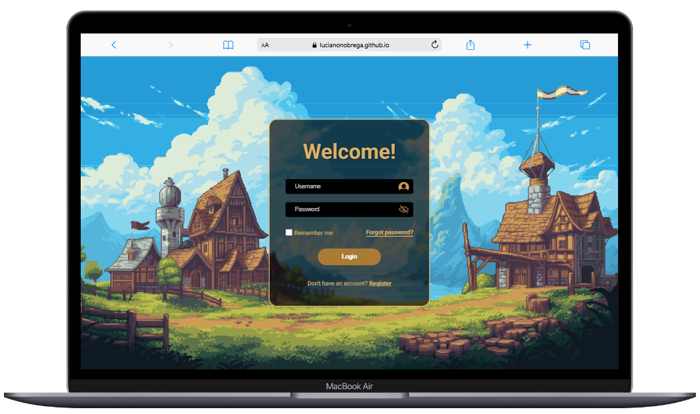

# 📌Templates Login

Este repositório foi criado para armazenar Templates de Telas de Login responsivos desenvolvidos com HTML, CSS e JavaScript.

Cada projeto está organizado em pastas separadas com seus respectivos arquivos. Além disso, foram adicionadas imagens para demonstrar a interface de cada um.

# 📂 Templates

## 💻 Template 1️⃣

<br>

Link para testar: <a target="_blank">https://lucianonobrega.github.io/Templates-Login/TemplateLogin1/<a/>

# 🛠️ Como Executar os Projetos
1-Clone este repositório:
```bash
git clone https://github.com/lucianonobrega/LoginTemplates
```
2-Vá até a pasta do projeto e abra o que desejar.<br><br>
3-Abra o arquivo **index.html** no navegador.
